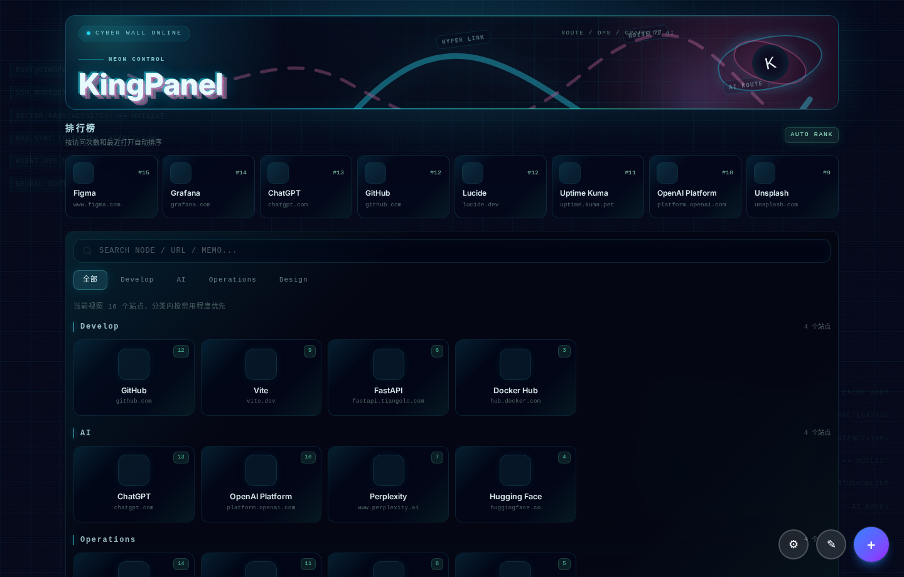
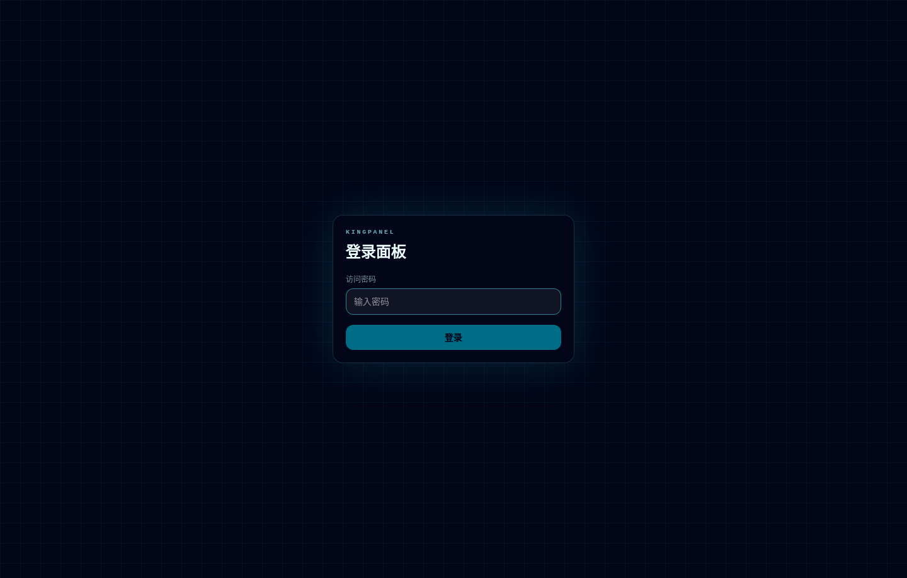
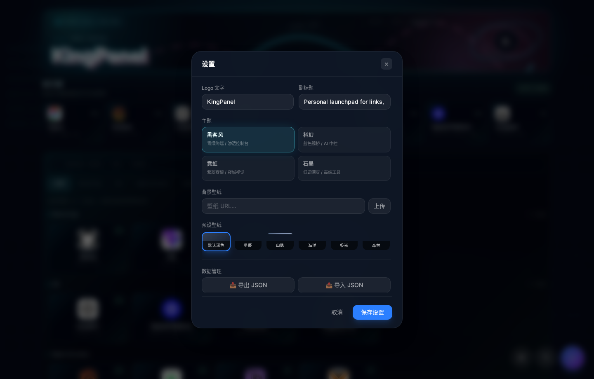

# KingPanel

KingPanel 是一个适合个人工作台、家庭服务器和小团队使用的自托管导航面板。它把网址导航、快速编辑、访问排行、主题壁纸、数据导入导出和轻量运维遥测放在同一个 FastAPI 服务里，部署简单，日常使用也足够顺手。



## 特性

- 登录保护：使用访问密码和 HttpOnly Cookie，会话不暴露给前端脚本。
- 站点管理：在主页面完成分类、站点、外网地址、内网地址、备注和图标维护。
- 自动排行：按访问次数和最近打开时间生成常用站点区。
- 快速检索：按名称、URL、内网地址和备注搜索。
- 个性化：支持 Logo 文案、主题预设、壁纸 URL 和壁纸上传。
- 数据迁移：支持 JSON 导入导出，导入前会自动备份当前 SQLite 数据库。
- 运维遥测：默认展示本机状态，也可以通过本地配置添加 SSH 主机。
- 单服务部署：React + Vite 构建产物由 FastAPI 直接托管，不需要额外前端服务。
- 本地存储：使用 SQLite，无需外部数据库。

## 界面预览

| 登录 | 设置 |
| --- | --- |
|  |  |

| 添加站点 | 主面板 |
| --- | --- |
|  |  |

## 快速开始

克隆仓库：

```bash
git clone https://github.com/xiaokaige1130-maker/kingpanel.git
cd kingpanel
```

创建 Python 环境并安装依赖：

```bash
python3 -m venv .venv
. .venv/bin/activate
pip install -r requirements.txt
```

启动前必须设置访问密码：

```bash
export KINGPANEL_PASSWORD='change-this-password'
```

启动服务：

```bash
python main.py
```

浏览器访问：

```text
http://localhost:5180
```

## 配置

必填环境变量：

```bash
export KINGPANEL_PASSWORD='your-password'
```

如果部署在 HTTPS 反向代理后面，建议开启 Secure Cookie：

```bash
export KINGPANEL_COOKIE_SECURE=1
```

运行时文件默认不提交到 Git：

| 路径 | 说明 |
| --- | --- |
| `nav.db` | SQLite 数据库 |
| `nav.db.bak*` | 导入数据前自动生成的备份 |
| `site/uploads/` | 上传的图标和壁纸 |
| `ops_hosts.local.json` | 本地 SSH 遥测主机配置 |
| `.venv/` | Python 虚拟环境 |

## 前端开发

仓库已经包含构建后的前端文件，普通部署不需要安装 Node.js。

如果需要改前端：

```bash
cd frontend
npm install
npm run dev
```

构建生产文件：

```bash
cd frontend
npm run build
```

构建产物使用稳定文件名，方便后端直接托管：

```text
site/assets/index.js
site/assets/index.css
```

## 运维遥测

KingPanel 默认展示本机状态。远程主机遥测通过本地文件配置：

```json
{
  "hosts": [
    {
      "id": "nas",
      "name": "NAS",
      "address": "nas.example.local",
      "username": "admin",
      "key_filename": "/home/user/.ssh/id_ed25519"
    }
  ]
}
```

保存为：

```text
ops_hosts.local.json
```

这个文件已经加入 `.gitignore`，不要提交。建议使用 SSH 密钥，不要在配置里保存有效密码。

## 数据导入导出

设置面板支持导出和导入完整导航数据。导入 JSON 前，KingPanel 会自动备份当前 `nav.db`，避免误操作后无法恢复。

项目还包含一个 Sun-Panel 数据迁移辅助脚本：

```bash
python export_sunpanel.py
```

如果准备公开部署或公开仓库，请先检查导出的导航数据里是否包含内网地址、私有域名或个人入口。

## PM2 部署

仓库包含 `ecosystem.config.js`：

```bash
pm2 start ecosystem.config.js
pm2 logs kingpanel
```

确保 PM2 环境中已经设置 `KINGPANEL_PASSWORD`。

## 安全说明

KingPanel 面向自托管场景设计。公开版没有默认密码：未设置 `KINGPANEL_PASSWORD` 时服务会拒绝启动。

如果服务暴露到公网：

- 使用 HTTPS。
- 设置 `KINGPANEL_COOKIE_SECURE=1`。
- 使用高强度访问密码。
- 不要公开 `nav.db`、`site/uploads/` 和 `ops_hosts.local.json`。
- 谨慎启用 SSH 运维遥测，只配置你信任的主机。

## 项目结构

```text
.
├── main.py                  # FastAPI 入口
├── db.py                    # SQLite 初始化和迁移
├── models.py                # Pydantic 数据模型
├── routers/                 # API 路由模块
├── frontend/                # React + Vite 源码
├── site/                    # 前端构建产物，由 FastAPI 托管
└── docs/screenshots/        # README 截图
```

## 检查命令

Python 语法检查：

```bash
python3 -m py_compile main.py db.py models.py routers/*.py
```

前端检查：

```bash
cd frontend
npm run lint
npm run build
```
